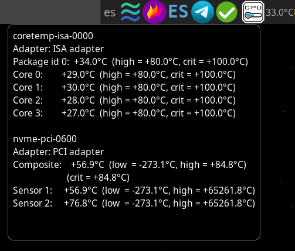
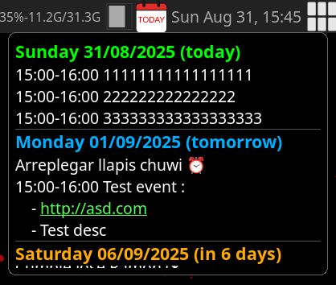

## kr0mWidgets:

Custom awesomeWM widgets by kr0m([AlfaExploit](https://alfaexploit.com)).

### Dependencies:
```bash
apt install upower power-profiles-daemon lm-sensors khal vdirsyncer
```

For calendar functionality it's required a calendar server setup as [described here.](https://alfaexploit.com/en/posts/calendar_server)

### Features:

CPU, RAM, battery, cpu temp. widgets provides icon and text information.
|           CPU          |         RAM            |
|:----------------------:|:----------------------:|
|  |  |

Cpu temp widget will change the icon color and thermometer bar depending on temperature, finally blinking a flame if critical threshold is exceeded.
|           Cold          |            Warm            |           Hot          |            Fire             |
|:-----------------------:|:--------------------------:|:----------------------:|:---------------------------:|
| |  |  |  |

When mouse hovers icon, sensors command output is shown:


Battery widget is a little special, as information is coded in the icon color schema:
- Battery indicator green: Power-saver profile applied.
- Battery indicator mustard: Balanced profile applied.
- Battery indicator red: Performance profile applied.

Lighting symbol indicates AC is pluged-in, blinking warning icon indicates battery is <= 5%.

| Energy |                 Power-saver                |                Balanced                |                  Performance                 |
|:------:|:------------------------------------------:|:--------------------------------------:|:--------------------------------------------:|
|Battery |        |        |        |
|   AC   |  |  |  |

Critical battery threshhold:


Calendar events display an icon that when clicked will display next 30d pending events, if some event happens the current day, tomorrow, or next 30 days, icon text will change:
|                                            |                                              |                                        |                                           |
| :----------------------------------------: | :------------------------------------------: | :------------------------------------: | :---------------------------------------: |
|  |  | |  |

Event list is scrollable and if some event have a description it will appear each description line under the event name, furthermore if a link is detected, it will be clickable.


***NOTE:*** `Guard` event name is reserved for my personal use related to a custom external service integration. Please avoid its use as `icon change` functionality ignores events with that name.

### Installation:

```bash
cd ~/.config/awesome
git clone https://github.com/ARPABoy/kr0mWidgets.git
```

### Usage:

```bash
vi ~/.config/awesome/rc.lua
```
```lua
require("kr0mWidgets.batteryPercentage")
require("kr0mWidgets.cpuTemp")
require("kr0mWidgets.cpuUsage")
require("kr0mWidgets.ramUsage")
require("kr0mWidgets.calendarEvents")


Use widgets wherever you desire:
        { -- Right widgets
            kr0mBatteryIcon,
            kr0mBatteryData,
            kr0mCpuTempIcon,
            kr0mCpuTempData,
            kr0mCpuIcon,
            kr0mCpuData,
            kr0mRamIcon,
            kr0mRamData,
            kr0mCalendarEventsIcon,
        },
```
